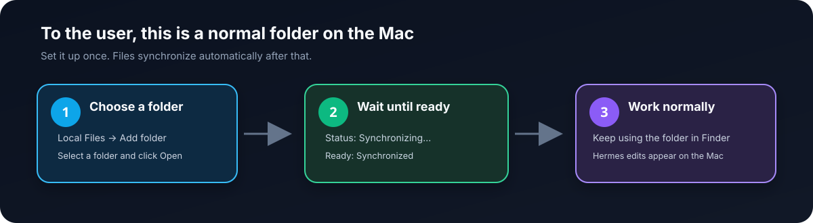
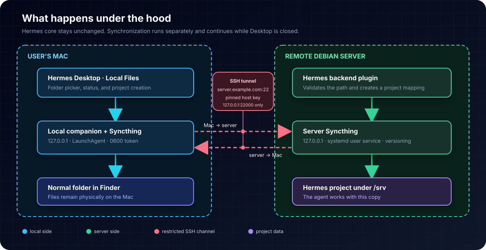

# Hermes Local Files

**English** | [Русский](README.ru.md)

[](https://github.com/Joskmo/hermes-local-files/actions/workflows/ci.yml)


Hermes Local Files lets you select a normal folder on a Mac and open it as a
project in Hermes running on a remote server. The user keeps working with the
same files in Finder while changes synchronize automatically in both directions.

> [!IMPORTANT]
> This plugin does not modify Hermes core. Desktop updates do not require you to
> reapply patches or maintain a fork.

<p align="center">
  
</p>

## What the user sees

Hermes gets a **Local Files** section with an **Добавить папку** (Add folder)
button. After the user selects a folder, the plugin:

1. creates a protected server-side copy;
2. enables bidirectional synchronization;
3. waits until both peers have all files;
4. registers the server folder as a regular Hermes Project.

The user continues working with the folder on the Mac. There is no SSH,
Syncthing, server-path, or manual Push/Pull workflow in normal use.

| UI status | Meaning | Action required |
|---|---|---|
| **Синхронизировано** | Mac and server have current files | None |
| **Синхронизация…** | Changes are transferring or the network is recovering | Usually none |
| **Нужно внимание** | A conflict or technical error was detected | Open Local Files |

Synchronization runs independently of the Hermes window. Closing Desktop does
not stop the background services, and they reconnect after sleep or network loss.

## Architecture

<p align="center">
  
</p>

Three LaunchAgents run on the Mac:

- Syncthing watches selected folders;
- SSH maintains a private tunnel to the home server;
- the companion opens the Finder picker and reports state to the Desktop plugin.

On Debian, Syncthing runs as a systemd user service alongside the backend part of
the Hermes plugin. Project data, the Syncthing database, and version history live
on the large `/srv` volume.

## Quick installation

Install components in this order:

```text
1. Debian server
2. Mac
3. first disposable test project
4. bidirectional verification
```

### Option 1: delegate installation to an AI agent

Give the agent access to the checkout and use this prompt:

```text
Install Hermes Local Files by following docs/agent-installation.md.
Use ./bin/hermes-local-files as the primary interface.
Run source checks, server installation and server doctor first, followed by
macOS installation and macOS doctor. Never ask me to paste passwords or private
keys into chat. Do not report success until file creation and deletion have been
verified in both directions and synchronization has recovered after a tunnel
interruption. Report Source verified, Server ready, Mac ready, and E2E ready
separately.
```

See the full [agent installation contract](docs/agent-installation.md). The
repository also includes the
[`hermes-local-files-operations`](skills/hermes-local-files-operations/SKILL.md)
Hermes skill.

### Option 2: install manually

#### Step 1: server

Choose the target profile and a private data directory below `/srv`:

```bash
export HERMES_PROFILE="<profile>"
export HERMES_HOME="$HOME/.hermes/profiles/$HERMES_PROFILE"
hermes plugins install Joskmo/hermes-local-files --enable
cd "$HERMES_HOME/plugins/local-files"
./bin/hermes-local-files install-server \
  --data-root "/srv/hermes-local-files/$HERMES_PROFILE"
./bin/hermes-local-files doctor --scope server --json
```

The server installer does not require root. It installs pinned Syncthing `v2.1.3`
as a user service and keeps growing data under:

```text
/srv/hermes-local-files/<profile>/
├── projects/
└── syncthing/
```

If the profile-scoped backend is already running, reconnect that profile in
Hermes Desktop after enabling the plugin. Do not restart unrelated messaging
gateways.

#### Step 2: Mac

Clone the same commit and run:

```bash
git clone git@github.com:Joskmo/hermes-local-files.git
cd hermes-local-files
./bin/hermes-local-files install-macos \
  --ssh-target "<user>@<server>" \
  --ssh-port 22 \
  --host-key-sha256 "SHA256:<verified-ed25519-fingerprint>" \
  --connection-id "<hermes-desktop-connection-id>" \
  --profile "<profile>"
./bin/hermes-local-files doctor --scope macos --json
```

Obtain the ED25519 fingerprint through an independent trusted channel before
running the installer. The first run may request existing administrative SSH
authentication once to register a separate restricted key. The plugin does not
store the password or administrative private key.

Restart Hermes Desktop once after installation. Open **Local Files** and select a
small disposable test folder.

## CLI

`./bin/hermes-local-files` is designed for people and automation. Commands do not
print tokens and return a non-zero exit code when a check fails.

| Command | Purpose |
|---|---|
| `version` | Print the CLI version |
| `install-server` | Install server Syncthing and its user service |
| `install-macos` | Install the Desktop plugin, companion, and LaunchAgents |
| `doctor --scope server --json` | Run machine-readable server checks |
| `doctor --scope macos --json` | Run machine-readable Mac checks |
| `status --scope auto` | Print a short human-readable status |

Example response for an agent:

```json
{
  "schema_version": 1,
  "ok": false,
  "scope": "macos",
  "checks": [
    {
      "id": "ssh-tunnel",
      "ok": false,
      "detail": "not listening",
      "remedy": "Check SSH reachability and the tunnel LaunchAgent log."
    }
  ]
}
```

Agents must check both the process exit code and the `ok` field. A running
process alone does not prove that files are synchronizing.

## Security model

- Syncthing GUI/API and sync listeners bind to `127.0.0.1`;
- global and LAN discovery, NAT traversal, and public relays are disabled;
- the server sync listener is reachable only through an SSH local forward;
- the ED25519 host key is checked against a pinned fingerprint before credentialed login;
- the persistent tunnel key cannot open a shell and is limited to approved loopback ports;
- the client cannot submit an arbitrary server path;
- API keys and the local capability token use owner-only files (`0600`);
- the backend API remains behind normal Hermes authentication.

### Files that are not synchronized

```text
.env
.env.*
.git/
node_modules/
__pycache__/
.pytest_cache/
.DS_Store
```

`.env` stays on its source machine. `.git` is excluded because concurrent writes
to Git metadata from macOS and Linux can corrupt the repository.

### Conflicts and version history

When both peers edit the same file concurrently, Syncthing preserves a conflict
copy. The plugin reports **Нужно внимание** instead of silently choosing a
winner.

Server-side staggered versioning retains earlier versions of changes received by
the server from the Mac. This is an additional recovery layer, not a complete
backup or a record of every local edit made directly on the server.

## Verification status

```bash
npm run check
npm test
hermes plugins doctor . --ci
```

Automated tests cover path traversal and collisions, Syncthing REST contracts,
loopback-only transport, atomic mapping storage, companion authentication, the
initial-sync gate, Hermes Project RPC, installers, and the CLI JSON schema.

> [!NOTE]
> The project remains a pre-release until it is tested on the target Mac. Source
> tests and Plugin Doctor do not replace live Mac → server, server → Mac,
> deletion, and reconnection tests.

## Troubleshooting

Start with one command on the affected machine:

```bash
./bin/hermes-local-files doctor --scope auto --json
```

Do not edit YAML, plist, or Syncthing XML before reading the failed checks. A
repeated installer run is expected to preserve existing mappings.

See [DESIGN.md](DESIGN.md) for the detailed state and safety contract.

## Development

The Desktop runtime is one uncompiled ESM file. Hermes permits imports only from
`@hermes/plugin-sdk`, `react`, and `react/jsx-runtime`.

```bash
npm run build
npm run check
npm test
```

The workflow source is `plugins/local-files/desktop/workflow.mjs`; the UI template
is next to it, and the generated installation artifact is `desktop/plugin.js`.

## License

[MIT](LICENSE)
