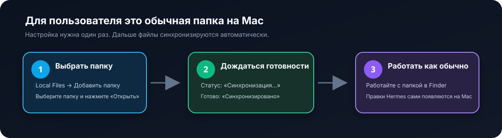
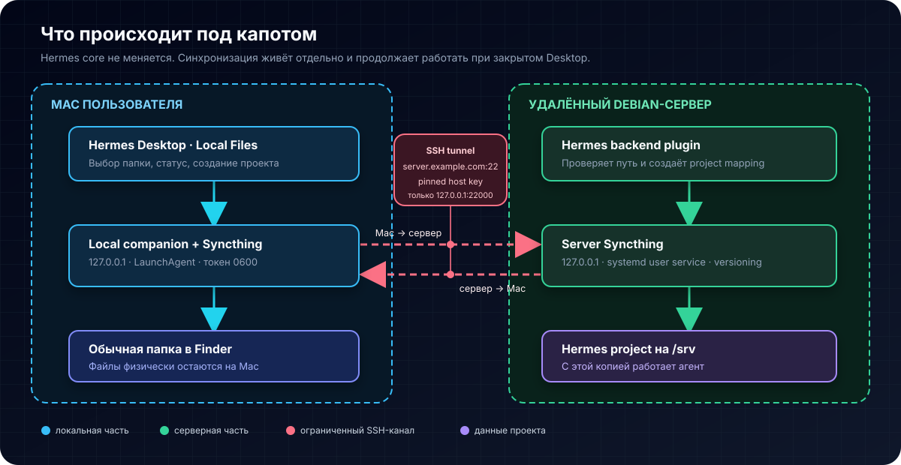

# Hermes Local Files

[English](README.md) | **Русский**

[](https://github.com/Joskmo/hermes-local-files/actions/workflows/ci.yml)


Плагин позволяет выбрать обычную папку на Mac и открыть её как проект в Hermes,
работающем на удалённом сервере. Пользователь продолжает видеть и редактировать
файлы в Finder, а изменения автоматически переносятся в обе стороны.

> [!IMPORTANT]
> Hermes core не меняется. Обновления Desktop не требуют повторного применения
> патчей или поддержки собственного форка.

<p align="center">
  
</p>

## Как это выглядит для пользователя

В Hermes появляется раздел **Local Files** с кнопкой **Добавить папку**. После
выбора папки плагин сам:

1. создаёт защищённую серверную копию;
2. включает двустороннюю синхронизацию;
3. ждёт, пока обе стороны получат все файлы;
4. регистрирует серверную папку как обычный Hermes Project.

После этого человек работает с файлами на Mac как обычно. Ему не нужно понимать
SSH, Syncthing, серверные пути или нажимать Push/Pull.

| Статус | Что означает | Нужно ли что-то делать |
|---|---|---|
| **Синхронизировано** | Mac и сервер видят актуальные файлы | Нет |
| **Синхронизация…** | Идёт перенос изменений или восстанавливается сеть | Обычно нет |
| **Нужно внимание** | Найден конфликт или техническая ошибка | Открыть Local Files |

Синхронизация работает независимо от окна Hermes. Если закрыть Desktop, фоновые
службы продолжат работать. После сна или пропадания сети они подключатся снова.

## Что происходит под капотом

<p align="center">
  
</p>

На Mac работают три LaunchAgent:

- Syncthing следит за выбранными папками;
- SSH поддерживает закрытый туннель до домашнего сервера;
- companion открывает Finder picker и сообщает состояние Desktop-плагину.

На Debian работают Syncthing как systemd user service и backend-часть Hermes
plugin. Проекты, база Syncthing и история версий хранятся на большом разделе
`/srv`.

## Быстрая установка

Устанавливать нужно в таком порядке:

```text
1. Debian server
2. Mac
3. первый тестовый проект
4. проверка в обе стороны
```

### Вариант 1: поручить установку ИИ-агенту

Дайте агенту доступ к checkout и отправьте этот prompt:

```text
Установи Hermes Local Files по инструкции docs/agent-installation.md.
Используй ./bin/hermes-local-files как основной интерфейс.
Сначала выполни source checks, затем server install и server doctor,
потом macOS install и macOS doctor. Не проси присылать пароли или ключи
в чат. Не объявляй готовность, пока не проверишь создание и удаление
тестовых файлов в обе стороны и восстановление после разрыва tunnel.
В отчёте раздели Source verified, Server ready, Mac ready и E2E ready.
```

Полная инструкция: [docs/agent-installation.md](docs/agent-installation.md).
В репозиторий также входит skill
[`hermes-local-files-operations`](skills/hermes-local-files-operations/SKILL.md).

### Вариант 2: установить вручную

#### Шаг 1. Сервер

Выберите профиль и закрытый каталог данных ниже `/srv`:

```bash
export HERMES_PROFILE="<profile>"
export HERMES_HOME="$HOME/.hermes/profiles/$HERMES_PROFILE"
hermes plugins install Joskmo/hermes-local-files --enable
cd "$HERMES_HOME/plugins/local-files"
./bin/hermes-local-files install-server \
  --data-root "/srv/hermes-local-files/$HERMES_PROFILE"
./bin/hermes-local-files doctor --scope server --json
```

Server installer не требует root. Он устанавливает pinned Syncthing `v2.1.3` как
user service и хранит растущие данные здесь:

```text
/srv/hermes-local-files/<profile>/
├── projects/
└── syncthing/
```

Если profile-scoped backend уже запущен, переподключите выбранный профиль в
Hermes Desktop после enable. Посторонние messaging gateway перезапускать не
нужно.

#### Шаг 2. Mac

Клонируйте тот же commit и запустите:

```bash
git clone git@github.com:Joskmo/hermes-local-files.git
cd hermes-local-files
./bin/hermes-local-files install-macos \
  --ssh-target "<user>@<server>" \
  --ssh-port 22 \
  --host-key-sha256 "SHA256:<verified-ed25519-fingerprint>" \
  --connection-id "<hermes-desktop-connection-id>" \
  --profile "<profile>"
./bin/hermes-local-files doctor --scope macos --json
```

До запуска получите ED25519 fingerprint по независимому доверенному каналу.
Первый запуск может один раз запросить существующую SSH-аутентификацию, чтобы
зарегистрировать отдельный restricted key. Пароль и административный private key
не сохраняются в плагине.

После установки перезапустите Hermes Desktop один раз, откройте **Local Files** и
выберите небольшую тестовую папку.

## CLI

`./bin/hermes-local-files` предназначен для человека и автоматизации. Команды не
печатают токены и возвращают ненулевой exit code при проблеме.

| Команда | Назначение |
|---|---|
| `version` | Показать версию CLI |
| `install-server` | Установить server Syncthing и user service |
| `install-macos` | Установить Desktop plugin, companion и LaunchAgent |
| `doctor --scope server --json` | Полная машинная проверка сервера |
| `doctor --scope macos --json` | Полная машинная проверка Mac |
| `status --scope auto` | Короткий статус для человека |

Пример ответа для агента:

```json
{
  "schema_version": 1,
  "ok": false,
  "scope": "macos",
  "checks": [
    {
      "id": "ssh-tunnel",
      "ok": false,
      "detail": "not listening",
      "remedy": "Check SSH reachability and the tunnel LaunchAgent log."
    }
  ]
}
```

Агент должен проверять и exit code, и поле `ok`. Запущенный процесс сам по себе
не доказывает, что файлы синхронизируются.

## Безопасность

- Syncthing GUI/API и sync listener привязаны к `127.0.0.1`;
- discovery, LAN discovery, NAT traversal и public relays отключены;
- сервер доступен только через SSH local-forward;
- ED25519 host key проверяется по pinned fingerprint до credentialed login;
- постоянный ключ не может открыть shell и ограничен разрешённым loopback port;
- клиент не может выбрать произвольный путь на сервере;
- API keys и local capability token хранятся в файлах mode `0600`;
- backend API проходит через штатную аутентификацию Hermes.

### Что не синхронизируется

```text
.env
.env.*
.git/
node_modules/
__pycache__/
.pytest_cache/
.DS_Store
```

`.env` остаётся только на исходной машине. `.git` не синхронизируется, поскольку
одновременная запись Git metadata на macOS и Linux может повредить repository.

### Конфликты и история

Если один файл изменили одновременно на Mac и сервере, Syncthing сохраняет
conflict-копию. Плагин показывает **Нужно внимание** и не выбирает победителя
молча.

Server-side staggered versioning хранит предыдущие версии изменений, полученных
сервером с Mac. Это дополнительная страховка, но не полноценный backup и не
история каждой локальной правки, сделанной на сервере.

## Что уже проверено

```bash
npm run check
npm test
hermes plugins doctor . --ci
```

Автоматические тесты покрывают path traversal и collision, Syncthing REST,
loopback-only transport, atomic mapping store, companion authentication,
initial-sync gate, Hermes Project RPC, installers и CLI JSON schema.

> [!NOTE]
> До live-проверки на Mac проект остаётся pre-release. Source tests и Plugin
> Doctor не заменяют E2E: Mac → server, server → Mac, удаления и reconnect.

## Диагностика

Начните с одной команды на проблемной машине:

```bash
./bin/hermes-local-files doctor --scope auto --json
```

Не исправляйте YAML, plist или Syncthing XML вручную до чтения failed checks.
Повторный installer должен сохранять существующие mappings.

Подробная схема состояний и ограничений: [DESIGN.md](DESIGN.md).

## Разработка

Desktop runtime — один uncompiled ESM-файл. Hermes разрешает ему импортировать
только `@hermes/plugin-sdk`, `react` и `react/jsx-runtime`.

```bash
npm run build
npm run check
npm test
```

Исходный workflow находится в `plugins/local-files/desktop/workflow.mjs`, шаблон
UI — рядом, а готовый файл генерируется как `desktop/plugin.js`.

## Лицензия

[MIT](LICENSE)
